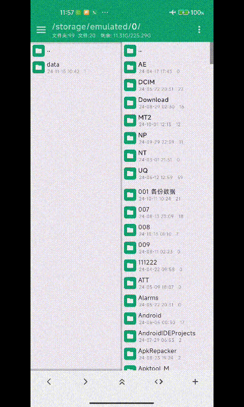

# android-compose-fast-scrollbar
Android compose draggable and fast scrollbar

# 项目背景
我在使用安卓Compose开发自己的【JK管理器】的过程中，很多地方都需要使用滚动条，在Github上也有实现的比较好，但是大多都是基于View（我要的是Compose啊）。

在研究Android 官方示例项目 [nowinandroid](https://github.com/android/nowinandroid) 中，它里面有一个 Scrollbar 组件，完成度还是比较高（但是还是传统的滚动条），如果想实现固定长度的滚动条，还需要自己实现或者修改。所以以下代码是我参考 NowInAndroid 项目的 Scrollbar 组件修改增强的一个滚动条组件（大部分内容已经魔改）。

注意：只适合 Lazy 相关组件（LazyColumn、LazyGrid、LazyStaggeredGrid）

使用方式: 目前提供的是源码，直接下载复制使用。

